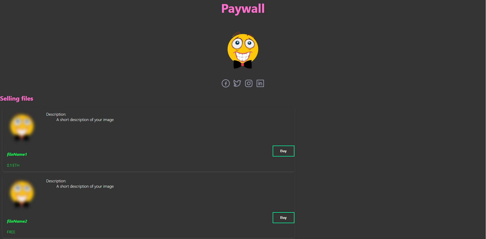
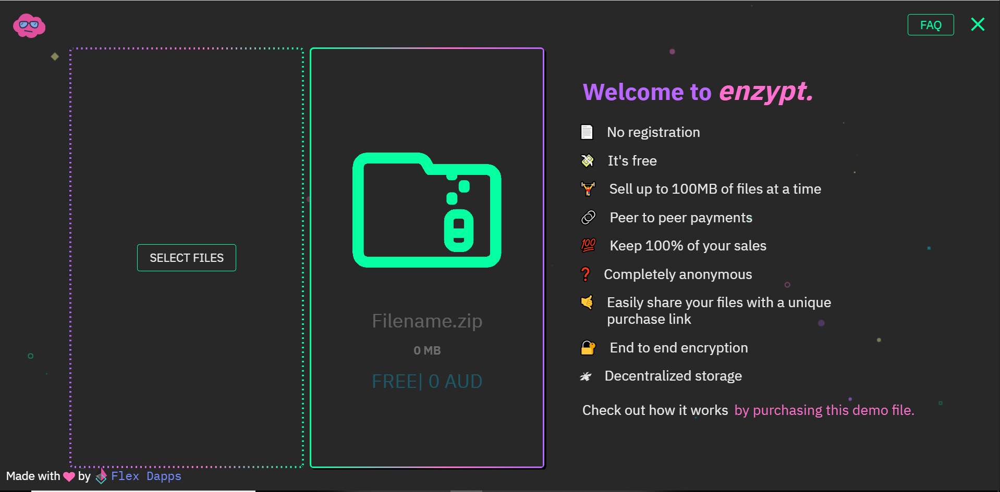

# enzypt-template
This is a template of a decentralized file sharing system using <a href="https://enzypt.io/" alt="enzypt link" target="_blank">Enzypt</a> API.

The template is developed using ReactJS.

Follow the comments along the code to replace and fill in the information for a complete web page.

# File Sharing/Selling:
This template only works as a "gallery" for people who wants to sell their files/images.

The actual file sharing mechanism is taken care by <a href="https://enzypt.io/" alt="enzypt link" target="_blank">Enzypt.io</a>

Users are supposed to share their files using Enzypt first and get the URL of the shared files to update the Paywall to sell those files.

People can buy files on the Paywall using ether, they have to pay the price that the seller set when they sell the file via Enzypt.